#### 线段树 == 平衡二叉搜索树（完全二叉树）

>  将一个**线段区间**划分成一些**单元区间**。对于线段树中的每一个**非叶子**节点[a,b]，**左儿子**表示的区间为[a,(a+b)/2]，**右儿子**表示的区间为[(a+b)/2+1,b]，最后的**叶子节点**数目为N，与数组下标对应。线段树的一般包括**建立、查询、插入、更新**等等操作，建立规模为N的时间复杂度为O(NlogN)，其他操作的时间复杂度为O(logN)
>
> 最大价值：**平衡**

* 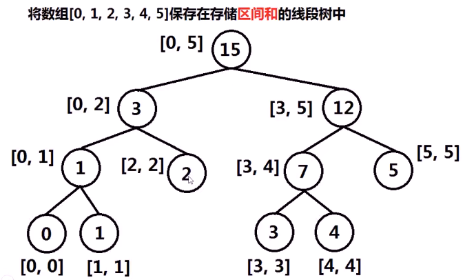

* 线段树的存储
  * 完全二叉树 --> 数组
    * 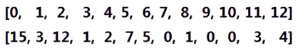
  * 将[0,1,2,3,4,5]存储在**区间和**的线段树中
    * 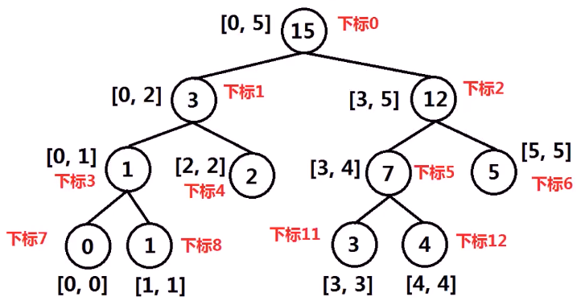
    * **根节点**下标**为0**，设某个节点下标为i，**左孩子**下标为**2*i+1**，**右孩子下标为 2 * i+2**
* 线段树的构造
  * 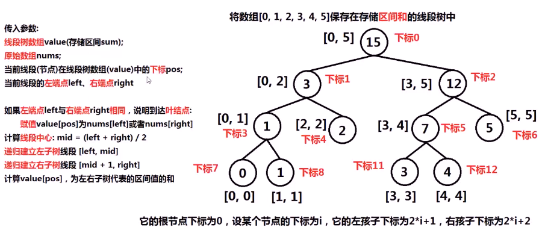
  * 代码实现
    * 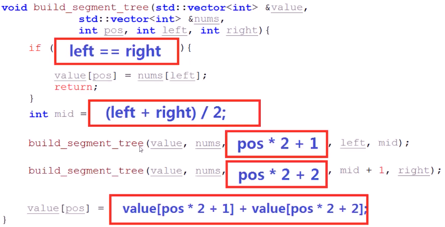
* 测试
  * 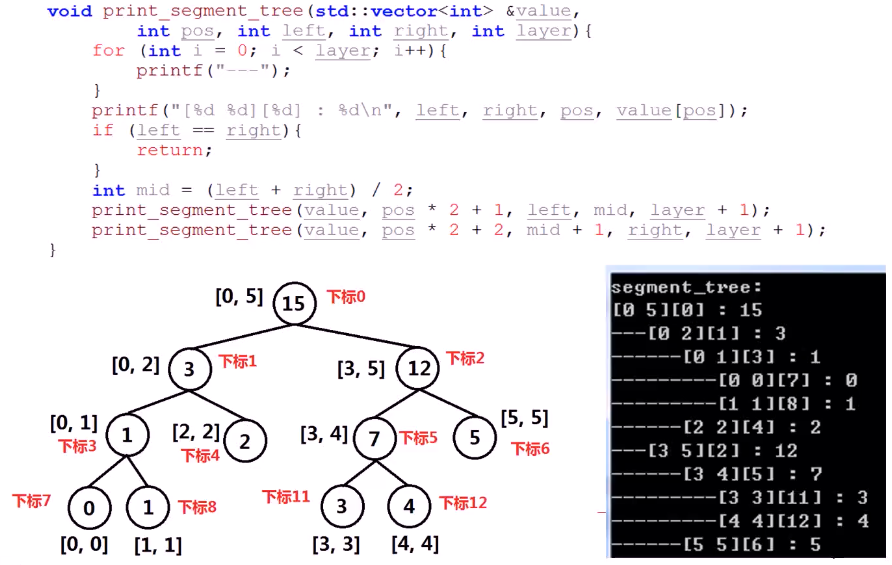

* 线段树的求和
  * 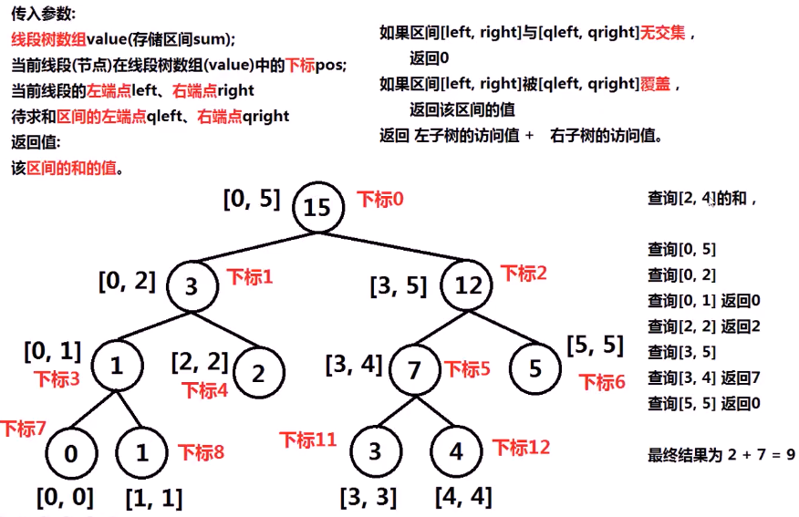
  * 代码实现
    * 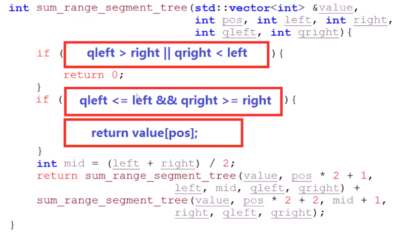

* 线段树更新
  * 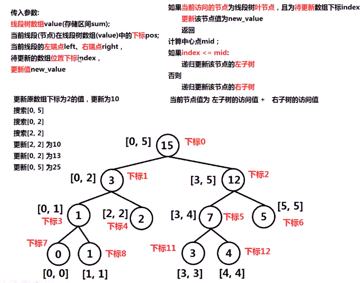
  * 代码实现
    * 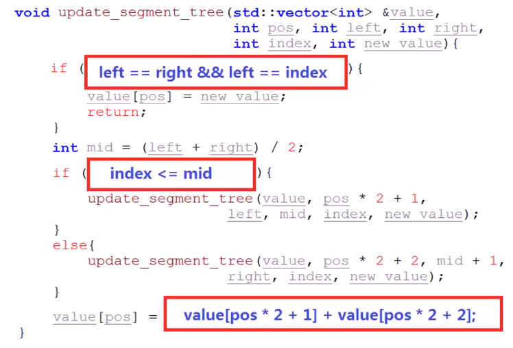

* 整体测试
  * 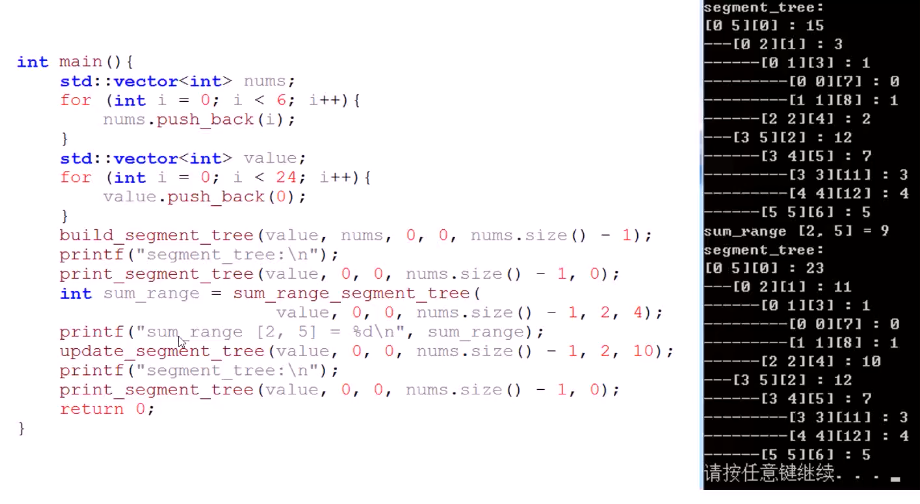

